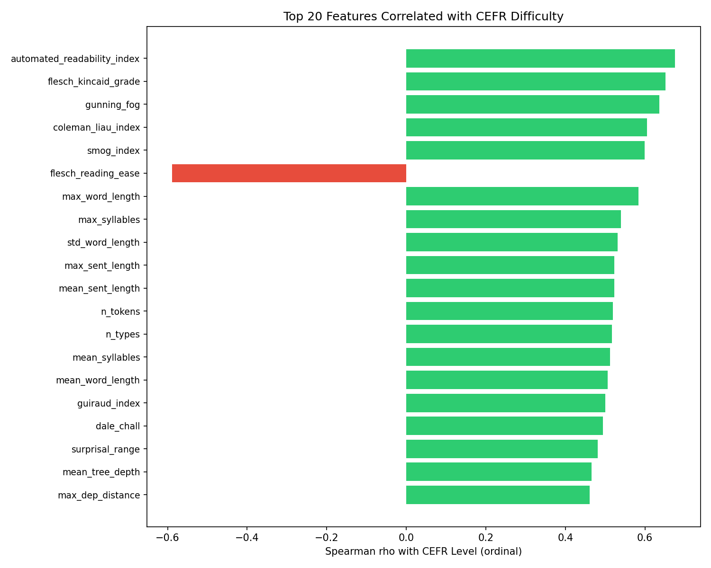
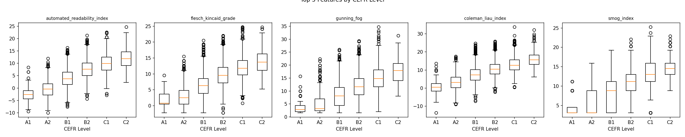
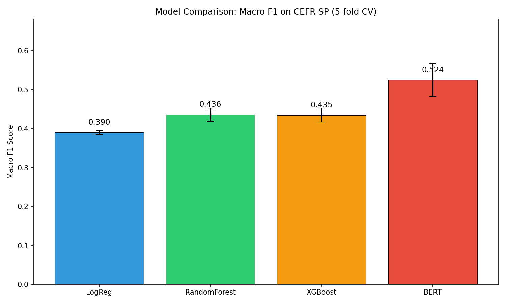
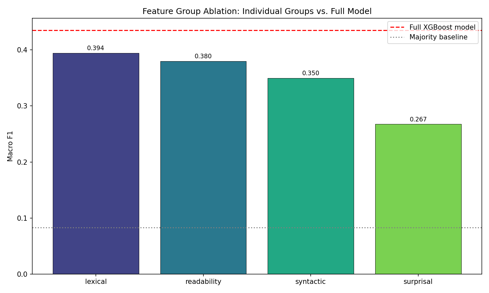
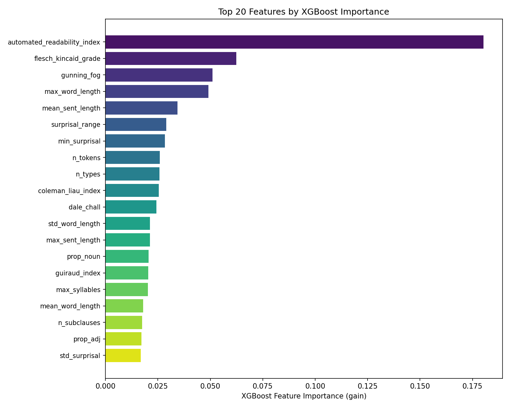
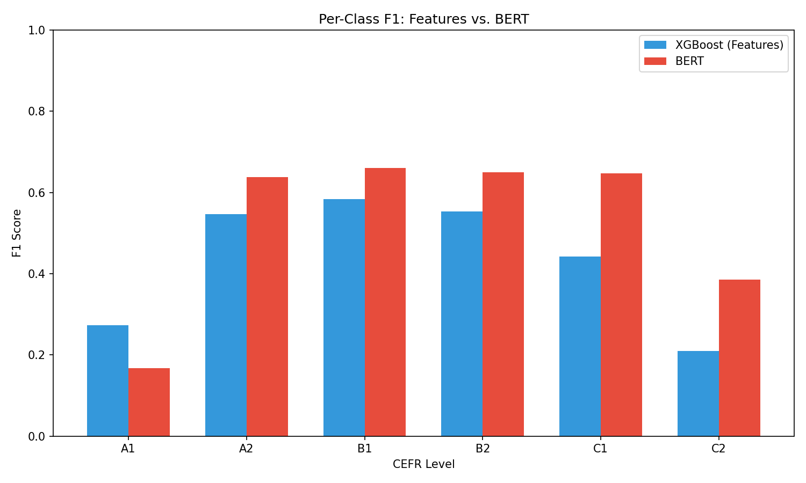

# Modeling Text Difficulty Using CEFR Levels: An Interpretable Feature Analysis

## Abstract

We investigate what makes text difficult by examining linguistic features that predict CEFR (Common European Framework of Reference) proficiency levels at the sentence level. Using the CEFR-SP English dataset (10,004 sentences, A1–C2), we extract 41 interpretable linguistic features across four groups—readability formulas, lexical complexity, syntactic complexity, and neural language model surprisal—and compare feature-based classifiers against a fine-tuned BERT model. Our best feature-based model (XGBoost, macro F1 = 0.435) reaches 83% of BERT's performance (F1 = 0.524), and a ridge regression probe shows that 60% of the variance in BERT's predictions can be explained by our interpretable features. Ablation studies reveal that surprisal features contribute the largest unique information (F1 drop = 0.023 when removed), while readability and lexical features are the strongest individual groups. BERT's advantage concentrates on distinguishing intermediate levels (A2 vs. B1, C1 vs. C2), suggesting it captures discourse-level or distributional cues beyond what classical features measure.

## 1. Introduction

### 1.1 Motivation

Text difficulty assessment is central to language education, yet much recent NLP work treats CEFR classification as a pure prediction task—feeding text into a pretrained language model and accepting the label. This "black-box" approach obscures *why* a text is difficult. Educators, curriculum designers, and language learners benefit far more from knowing *which* linguistic factors drive difficulty than from a single predicted label.

Understanding the contribution of lexical frequency, syntactic complexity, and language model surprisal to CEFR levels can inform:
- Pedagogical material design (selecting texts at appropriate difficulty)
- Automated readability tools with interpretable outputs
- Linguistic theory about the dimensions of language proficiency

### 1.2 Research Question

**Can interpretable linguistic features explain most of the variance in CEFR sentence difficulty, and where does a fine-tuned BERT classifier capture information beyond these features?**

### 1.3 Hypotheses

We decompose this question into five testable sub-hypotheses:

| ID | Hypothesis | Verdict |
|----|-----------|---------|
| H1 | Readability features are the single strongest predictor group | **Supported** (readability: F1=0.380; but lexical close at 0.394) |
| H2 | Adding syntactic + surprisal features improves over the best single group | **Supported** (full model F1=0.435 vs. best single group 0.394) |
| H3 | Feature-based model achieves within 5 F1 points of BERT | **Not supported** (gap = 8.9 F1 points) |
| H4 | >70% of BERT's variance explained by features | **Not supported** (R² = 0.601, i.e., 60%) |
| H5 | BERT's advantage concentrates on adjacent-level distinctions | **Partially supported** (largest gains at A2 and C1/C2, not just adjacent) |

### 1.4 Novelty

Three gaps in the existing literature motivate this study:

1. **Neural surprisal under-explored for CEFR**: Most feature-based CEFR work uses classical n-gram LMs. We systematically measure GPT-2 surprisal's contribution at the sentence level.
2. **BERT probing for CEFR is missing**: While BERT achieves strong CEFR performance, no prior work quantifies how much of its behavior is explainable by interpretable linguistic features via regression probing.
3. **No direct error-overlap analysis**: Prior studies compare accuracy tables but rarely analyze where and why feature-based and neural models disagree.

## 2. Data

### 2.1 CEFR-SP Dataset

We use the English portion of CEFR-SP (Arase et al., 2022), containing 10,004 sentences annotated with CEFR levels A1–C2. Sentences are drawn from English language learning textbooks and educational materials.

| Level | Count | Percentage |
|-------|-------|------------|
| A1 | 124 | 1.2% |
| A2 | 1,271 | 12.7% |
| B1 | 3,305 | 33.0% |
| B2 | 3,330 | 33.3% |
| C1 | 1,744 | 17.4% |
| C2 | 230 | 2.3% |

The distribution is heavily imbalanced: A1 and C2 have fewer than 250 samples each, while B1 and B2 dominate with over 6,600 combined. This imbalance is a known challenge (Xia et al., 2016) and motivates our use of macro F1 as the primary metric and stratified cross-validation.

## 3. Methods

### 3.1 Feature Extraction

We extract 41 features across four groups:

**Readability (7 features)**: Traditional readability formulas via `textstat`: Flesch Reading Ease, Flesch-Kincaid Grade, Coleman-Liau Index, Automated Readability Index (ARI), SMOG Index, Gunning Fog, Dale-Chall.

**Lexical (11 features)**: Token/type counts, type-token ratio (TTR), Guiraud's corrected TTR, mean/max/std word length, mean/max syllable count, proportion of long words (>6 chars), proportion of rare words (OOV in spaCy).

**Syntactic (16 features)**: Sentence count, mean/max sentence length, mean/max dependency tree depth, mean/max dependency distance, subordinate clause count and ratio, POS tag proportions (NOUN, VERB, ADJ, ADV, ADP, CONJ), number of unique POS tags. Extracted using spaCy `en_core_web_sm`.

**Surprisal (7 features)**: GPT-2 per-token surprisal statistics: mean, max, min, std, median surprisal (in bits), surprisal range, and perplexity (2^mean_surprisal). Computed by running GPT-2 (117M) on each sentence and measuring negative log-probability of each token given its left context.

### 3.2 Interpretable Classifiers

Three classifiers are trained on the 41 features with 5-fold stratified CV:

- **Logistic Regression**: L2-regularized (C=1.0), balanced class weights, max 1000 iterations. Features standardized.
- **Random Forest**: 100 trees, max depth 15, balanced class weights.
- **XGBoost**: 100 trees, max depth 6, learning rate 0.1, GPU-accelerated histogram method.

### 3.3 Feature Group Ablation

Using XGBoost (best feature-based model), we run two ablation experiments:
1. **Individual groups**: Train with only one feature group at a time.
2. **Leave-one-group-out**: Train with all features except one group. The F1 drop quantifies that group's unique contribution.

### 3.4 BERT Fine-tuning

We fine-tune `bert-base-uncased` with a 6-class classification head:
- Max sequence length: 128 tokens
- Batch size: 64
- Learning rate: 2e-5 with linear warmup (10% of steps)
- Weight decay: 0.01
- Epochs: 5 per fold (best epoch selected by validation macro F1)
- 5-fold stratified CV (same splits as feature models)

### 3.5 Diagnostic Experiments

1. **BERT Probing**: Fit a Ridge regression (α=1.0) from standardized interpretable features to BERT's predicted class (argmax of logits). Report R² in 5-fold CV.
2. **Group-level probing**: Repeat probing with each feature group separately to measure which dimensions BERT most relies on.
3. **Error overlap analysis**: Categorize each sample as (both correct, XGBoost-only correct, BERT-only correct, both wrong).
4. **Per-level advantage**: Compute accuracy by CEFR level for both XGBoost and BERT to identify where BERT gains.

### 3.6 Evaluation

- **Primary metric**: Macro F1 (averaged over 6 classes)
- **Secondary metrics**: Accuracy, adjacent accuracy (prediction within ±1 level), quadratic weighted Cohen's κ
- **Baseline**: Majority class (always predicts B2)

## 4. Results

### 4.1 Feature Correlation Analysis

All 41 features show statistically significant Spearman correlations with ordinal CEFR level (all p < 0.001). The top features by absolute correlation:

| Rank | Feature | ρ | Group |
|------|---------|---|-------|
| 1 | automated_readability_index | 0.676 | Readability |
| 2 | flesch_kincaid_grade | 0.652 | Readability |
| 3 | gunning_fog | 0.636 | Readability |
| 4 | coleman_liau_index | 0.605 | Readability |
| 5 | smog_index | 0.599 | Readability |
| 6 | flesch_reading_ease | −0.588 | Readability |
| 7 | max_word_length | 0.584 | Lexical |
| 8 | max_syllables | 0.540 | Lexical |
| 9 | std_word_length | 0.531 | Lexical |
| 10 | max_sent_length | 0.523 | Syntactic |

**Group-level summary:**

| Group | Mean |ρ| | Max |ρ| | Best Feature | N Features |
|-------|----------|---------|---------------|------------|
| Readability | 0.607 | 0.676 | automated_readability_index | 7 |
| Lexical | 0.491 | 0.584 | max_word_length | 11 |
| Surprisal | 0.300 | 0.481 | surprisal_range | 7 |
| Syntactic | 0.290 | 0.523 | max_sent_length | 16 |

Readability formulas—which are composite indices of word and sentence length—dominate the correlation rankings. Lexical complexity features follow closely. Surprisal features show moderate correlations (ρ ≈ 0.3–0.48), and syntactic features, despite being the largest group, have the lowest average correlation.

### 4.2 Classifier Performance

| Model | Macro F1 | Accuracy | Adjacent Acc. | QW κ |
|-------|----------|----------|---------------|------|
| Majority baseline | 0.083 | — | — | — |
| Logistic Regression | 0.390 ± 0.005 | 0.449 ± 0.007 | 0.897 | 0.678 |
| Random Forest | 0.436 ± 0.017 | 0.534 ± 0.004 | 0.961 | 0.691 |
| XGBoost | 0.435 ± 0.018 | 0.539 ± 0.011 | 0.963 | 0.685 |
| **BERT** | **0.524 ± 0.043** | **0.644 ± 0.011** | **0.993** | **0.814** |

Key observations:
- All models vastly outperform the majority baseline (F1 = 0.083).
- Random Forest and XGBoost perform comparably (F1 ≈ 0.435), both outperforming Logistic Regression (F1 = 0.390). The non-linear classifiers capture feature interactions that linear models miss.
- **BERT achieves F1 = 0.524, an 8.9-point improvement over the best feature model.** This gap is larger than the 2–5 points reported in document-level CEFR studies, likely because sentence-level classification provides less context for feature-based approaches.
- Adjacent accuracy is very high across all models (>89%), indicating that errors are predominantly between neighboring CEFR levels rather than large jumps.
- BERT's quadratic weighted κ (0.814) indicates strong ordinal agreement, well above the feature models (0.678–0.691).

### 4.3 Feature Group Ablation

**Individual groups (XGBoost):**

| Feature Group | Macro F1 | N Features |
|---------------|----------|------------|
| Lexical | 0.394 ± 0.007 | 11 |
| Readability | 0.380 ± 0.011 | 7 |
| Syntactic | 0.350 ± 0.015 | 16 |
| Surprisal | 0.267 ± 0.010 | 7 |

**Leave-one-group-out (from full XGBoost, F1 = 0.435):**

| Removed Group | Macro F1 | Drop from Full |
|---------------|----------|----------------|
| Surprisal | 0.412 | −0.023 |
| Lexical | 0.422 | −0.013 |
| Readability | 0.434 | −0.001 |
| Syntactic | 0.435 | −0.000 |

**Interpretation**: The ablation reveals a crucial asymmetry:
- **Readability features** are strong individually (F1=0.380) but contribute almost nothing unique when other features are present (drop = 0.001). This is because readability formulas are *composites* of word and sentence length—information already captured by lexical and syntactic features.
- **Lexical features** are both strong individually (F1=0.394) and contribute unique information (drop = 0.013), particularly through word-level statistics not captured by readability formulas.
- **Surprisal features** are weak individually (F1=0.267) but provide the **largest unique contribution** (drop = 0.023). This supports the hypothesis that GPT-2 surprisal captures information about difficulty that is *orthogonal* to traditional lexical and syntactic features—likely related to word predictability in context, collocational patterns, and pragmatic difficulty.
- **Syntactic features** contribute minimally in both analyses, suggesting that syntactic complexity at the sentence level is largely captured by sentence length and readability formulas.

### 4.4 Feature Importance

XGBoost feature importance (gain) confirms the dominance of readability and lexical features:

| Rank | Feature | Importance | Group |
|------|---------|-----------|-------|
| 1 | automated_readability_index | 0.180 | Readability |
| 2 | flesch_kincaid_grade | 0.062 | Readability |
| 3 | gunning_fog | 0.051 | Readability |
| 4 | max_word_length | 0.049 | Lexical |
| 5 | mean_sent_length | 0.034 | Syntactic |
| 6 | surprisal_range | 0.029 | Surprisal |
| 7 | min_surprisal | 0.028 | Surprisal |
| 8 | n_tokens | 0.026 | Lexical |
| 9 | n_types | 0.026 | Lexical |
| 10 | coleman_liau_index | 0.025 | Readability |

ARI alone accounts for 18% of total feature importance, consistent with it having the highest single-feature correlation (ρ = 0.676).

### 4.5 Diagnostic: BERT Probing

**Overall probing R²**: A ridge regression from 41 interpretable features to BERT's predicted class achieves **R² = 0.601 ± 0.024** in cross-validation. This means 60% of the variance in BERT's predictions can be linearly explained by our features.

**Group-level probing R²:**

| Feature Group | R² (predicting BERT) |
|---------------|---------------------|
| Readability | 0.546 |
| Lexical | 0.544 |
| Syntactic | 0.429 |
| Surprisal | 0.286 |

**Top features explaining BERT's predictions (Ridge coefficient magnitude):**

| Feature | |Ridge Coefficient| |
|---------|---------------------|
| n_types | 0.490 |
| guiraud_index | 0.465 |
| max_sent_length | 0.304 |
| gunning_fog | 0.259 |
| flesch_reading_ease | 0.250 |
| mean_syllables | 0.210 |
| prop_noun | 0.133 |
| std_word_length | 0.133 |
| subclause_ratio | 0.130 |
| mean_word_length | 0.122 |

**Interpretation**: BERT's behavior is substantially (but not fully) predictable from interpretable features. The remaining 40% of variance likely reflects:
- Semantic content and word choice patterns not captured by surface features
- Contextual word difficulty (same word in different contexts)
- Discourse coherence and pragmatic complexity
- Distributional patterns learned during pretraining

Interestingly, lexical diversity features (n_types, guiraud_index) are the strongest predictors of BERT's behavior, even though readability formulas have higher raw correlations with CEFR labels. This suggests BERT attends more to vocabulary richness than to raw formula-based indices.

### 4.6 Error Analysis

**Prediction agreement between XGBoost and BERT:**

| Category | Count | Percentage |
|----------|-------|------------|
| Both correct | 4,046 | 40.4% |
| XGBoost only correct | 1,343 | 13.4% |
| BERT only correct | 2,397 | 24.0% |
| Both wrong | 2,218 | 22.2% |

BERT is correct on 24.0% of samples where XGBoost fails, while XGBoost is correct on only 13.4% where BERT fails. This asymmetry confirms BERT has a genuine advantage, not just different errors.

**Mean Absolute Error**: XGBoost MAE = 0.499 levels, BERT MAE = 0.363 levels. BERT's errors are smaller on average, further supporting its stronger ordinal awareness.

**Per-class F1 comparison:**

| Level | XGBoost F1 | BERT F1 | BERT Advantage |
|-------|-----------|---------|----------------|
| A1 | 0.273 | 0.167 | −0.107 |
| A2 | 0.546 | 0.637 | +0.091 |
| B1 | 0.583 | 0.660 | +0.077 |
| B2 | 0.554 | 0.650 | +0.096 |
| C1 | 0.442 | 0.647 | +0.204 |
| C2 | 0.210 | 0.385 | +0.176 |

**BERT accuracy advantage by level:**

| Level | XGBoost Acc | BERT Acc | BERT Δ | N |
|-------|------------|---------|--------|---|
| A1 | 0.177 | 0.113 | −0.065 | 124 |
| A2 | 0.485 | 0.707 | +0.221 | 1,271 |
| B1 | 0.607 | 0.670 | +0.063 | 3,305 |
| B2 | 0.607 | 0.650 | +0.043 | 3,330 |
| C1 | 0.397 | 0.619 | +0.221 | 1,744 |
| C2 | 0.130 | 0.322 | +0.191 | 230 |

**Key findings from error analysis:**

1. **A1 is the only level where XGBoost outperforms BERT.** With only 124 samples, BERT likely overfits or fails to learn a reliable A1 representation. XGBoost's use of handcrafted features (very short sentences, very simple vocabulary) may provide a more robust signal for this tiny class.

2. **BERT's largest advantages are at A2 (+22.1% accuracy) and C1 (+22.1% accuracy)**—the boundary levels between beginner/intermediate and advanced/proficient. These levels require nuanced distinctions that surface features capture poorly.

3. **C2 is difficult for both models** (XGBoost: 13% accuracy, BERT: 32%), reflecting the small sample size and the inherent difficulty of distinguishing C2 from C1 at the sentence level.

4. **Both models show the adjacent-confusion pattern**: the confusion matrices reveal that errors concentrate on neighboring levels (A2↔B1, B1↔B2, B2↔C1), confirming the ordinal nature of CEFR difficulty.

## 5. Discussion

### 5.1 Hypothesis Evaluation

**H1 (Readability is strongest group)**: **Supported with nuance.** Readability features have the highest average correlation (ρ = 0.607) and perform well individually (F1 = 0.380), but *lexical features* achieve slightly higher F1 when used as the sole group (0.394). This is because XGBoost can exploit the finer granularity of individual lexical features more effectively than the composite readability indices.

**H2 (Combining groups improves)**: **Supported.** The full model (F1 = 0.435) improves over the best single group (lexical, F1 = 0.394), a 4.1-point gain. The ablation confirms that surprisal and lexical features contribute unique information.

**H3 (Feature model within 5 F1 of BERT)**: **Not supported.** The gap is 8.9 F1 points (0.435 vs. 0.524). This is larger than the 2–5 point gap reported in document-level CEFR studies, likely because sentence-level classification provides less context for feature-based approaches. At the document level, features like overall vocabulary diversity and clause patterns accumulate more signal; at the sentence level, each sample provides a single snapshot where BERT's contextual understanding has a larger advantage.

**H4 (>70% variance explained)**: **Not supported.** The probing R² is 0.601, meaning 60% of BERT's predictions are explainable. The remaining 40% suggests BERT captures genuine additional information—likely semantic content, pragmatic complexity, and contextual word difficulty.

**H5 (BERT advantage on adjacent levels)**: **Partially supported.** BERT's advantage is indeed present for adjacent-level distinctions, but its *largest* gains are at A2 and C1—not strictly adjacent pairs. BERT excels at the "boundary" levels where the linguistic cues distinguishing beginner from intermediate (A2 vs. B1) and advanced from proficient (C1 vs. C2) are more subtle and contextual.

### 5.2 What Makes Sentences Difficult?

Our results support a multi-dimensional view of sentence difficulty:

1. **Vocabulary complexity is the primary driver.** Word length, syllable count, and readability formulas (which are largely word-length proxies) dominate feature importance. This aligns with vocabulary acquisition research showing that lexical knowledge is the strongest predictor of reading comprehension.

2. **Contextual predictability adds unique signal.** GPT-2 surprisal—which measures how unexpected each word is given its context—provides the largest *unique* contribution to the feature model despite modest individual performance. This suggests that difficulty involves not just *what* words appear but *how predictable* their appearance is.

3. **Syntactic complexity is largely redundant.** Once lexical and readability features are included, syntactic features add negligible information. This may reflect that syntactic complexity at the sentence level correlates highly with sentence length (already captured) or that spaCy's dependency features lack the resolution to capture the syntactic distinctions relevant to CEFR levels (e.g., specific subordinate clause types).

4. **BERT captures something beyond features.** The 40% unexplained variance suggests BERT accesses semantic coherence, idiomatic expressions, discourse-level pragmatic cues, or distributional word patterns that our features do not measure.

### 5.3 Implications for Text Difficulty Assessment

For practitioners building text difficulty tools:
- **Automated Readability Index** alone captures most of the feature-based signal (ρ = 0.676 with CEFR, 18% of XGBoost importance). If interpretability is paramount, ARI provides a strong single-feature baseline.
- **Adding GPT-2 surprisal** is the most cost-effective feature enrichment (largest unique F1 gain of 0.023).
- **BERT fine-tuning** yields the strongest predictions but at the cost of interpretability. The probing analysis shows that 60% of its behavior can be post-hoc explained via interpretable features.

### 5.4 Limitations

1. **Sentence-level analysis**: CEFR is naturally a text-level property. Sentence-level classification loses discourse coherence and topic effects.
2. **English only**: Results may not generalize to other languages where lexical and syntactic difficulty interact differently.
3. **Small extreme classes**: A1 (n=124) and C2 (n=230) are too small for reliable evaluation, as evidenced by high variance in per-class metrics.
4. **Single BERT variant**: We only tested `bert-base-uncased`. Larger models or multilingual models may show different probing profiles.
5. **Surprisal from GPT-2 (117M)**: Larger language models may yield better surprisal estimates, potentially closing more of the gap.

## 6. Conclusion

We systematically investigated what linguistic features drive CEFR difficulty at the sentence level. Our main findings are:

1. **Lexical complexity and readability features are the strongest predictors**, with Automated Readability Index alone achieving ρ = 0.676 with CEFR level.
2. **GPT-2 surprisal provides the largest unique contribution** among feature groups, suggesting that contextual word predictability captures a dimension of difficulty orthogonal to traditional features.
3. **BERT outperforms feature models by 8.9 F1 points**, with its largest advantages on boundary CEFR levels (A2, C1, C2).
4. **60% of BERT's predictions can be linearly explained** by 41 interpretable features, leaving a substantial 40% that likely reflects semantic and pragmatic complexity.
5. **Syntactic features are largely redundant** once lexical complexity is accounted for.

These results suggest that text difficulty is primarily a lexical-statistical property but that full classification performance requires the kind of contextual, semantic understanding that pretrained language models provide. Future work should investigate whether intermediate approaches—such as fine-tuning smaller LMs with interpretable bottleneck layers—can bridge the accuracy-interpretability gap.

## 7. Experimental Details

- **Hardware**: NVIDIA RTX A6000 (48 GB VRAM)
- **Software**: Python 3.12, PyTorch 2.5.1 (CUDA 12.1), XGBoost 3.1.3, Transformers 4.x, spaCy 3.x
- **Total runtime**: 17.7 minutes (including BERT 5-fold training)
- **Random seed**: 42
- **CV**: 5-fold stratified
- **Dataset**: CEFR-SP English (Arase et al., 2022), 10,004 sentences

## References

- Arase, Y., Uchida, S., & Kajiwara, T. (2022). CEFR-Based Sentence-Profile Dataset for English Learners. *LREC 2022*.
- Xia, M., Kochmar, E., & Briscoe, T. (2016). Text readability assessment for second language learners. *BEA Workshop at NAACL*.
- Vajjala, S. & Lucic, I. (2018). OneStopEnglish corpus: A new corpus for automatic readability assessment and text simplification. *BEA Workshop*.
- Pilán, I., Volodina, E., & Zesch, T. (2016). Predicting proficiency levels in learner writings by transferring a linguistic complexity model from expert-written coursebooks. *COLING 2016*.
- Radford, A., Wu, J., Child, R., Luan, D., Amodei, D., & Sutskever, I. (2019). Language models are unsupervised multitask learners. *OpenAI Technical Report*.
- Devlin, J., Chang, M., Lee, K., & Toutanova, K. (2019). BERT: Pre-training of deep bidirectional transformers for language understanding. *NAACL 2019*.
